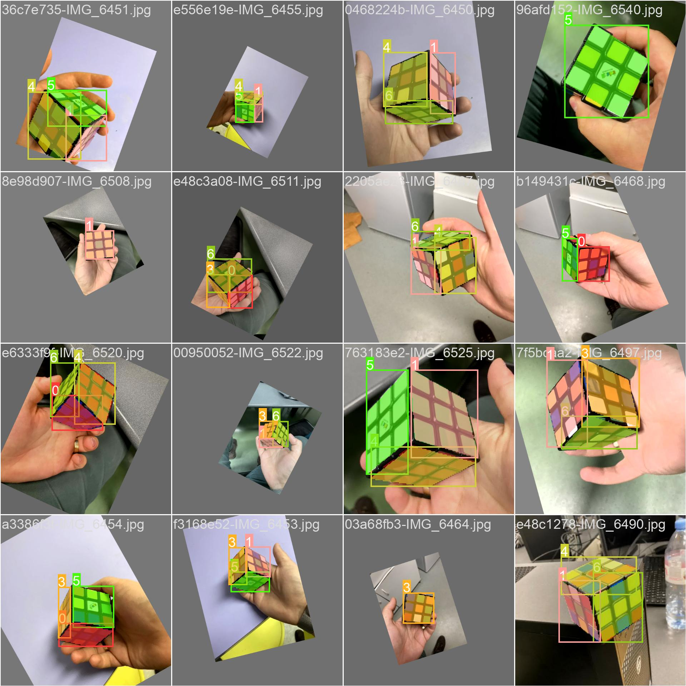
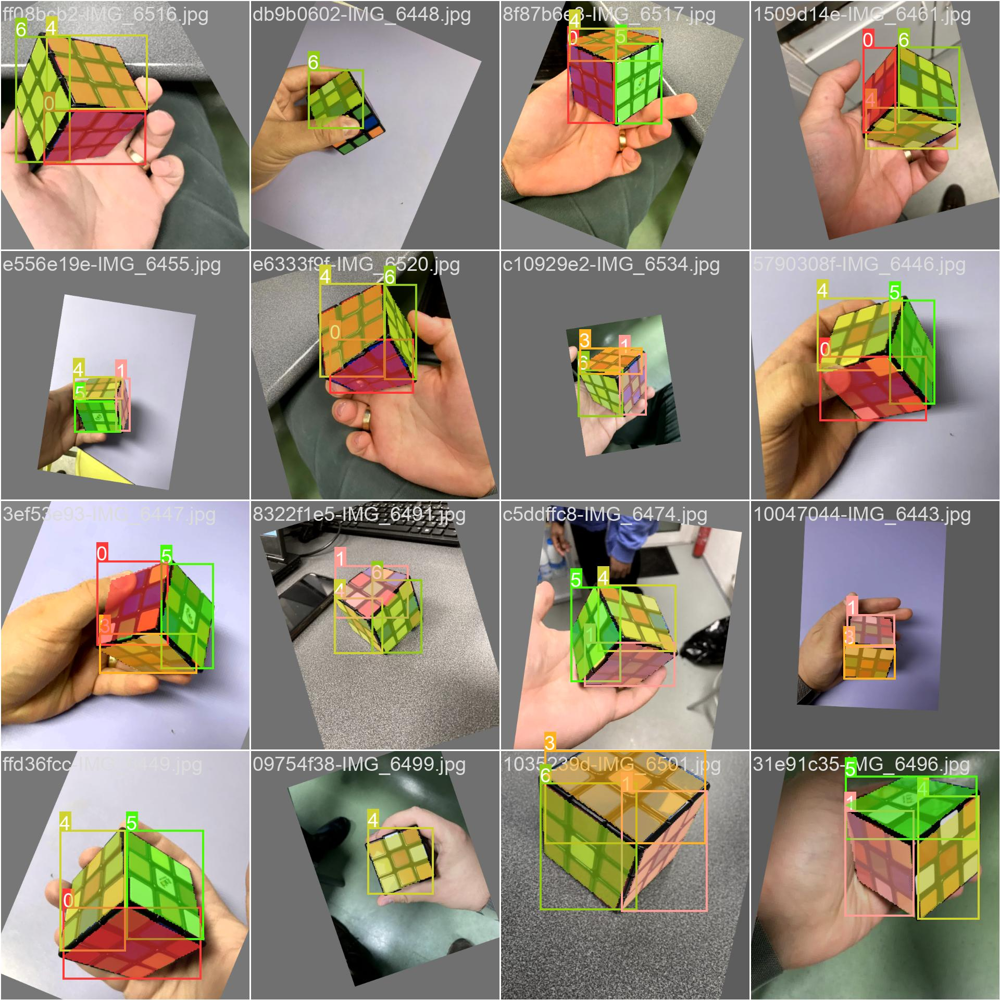
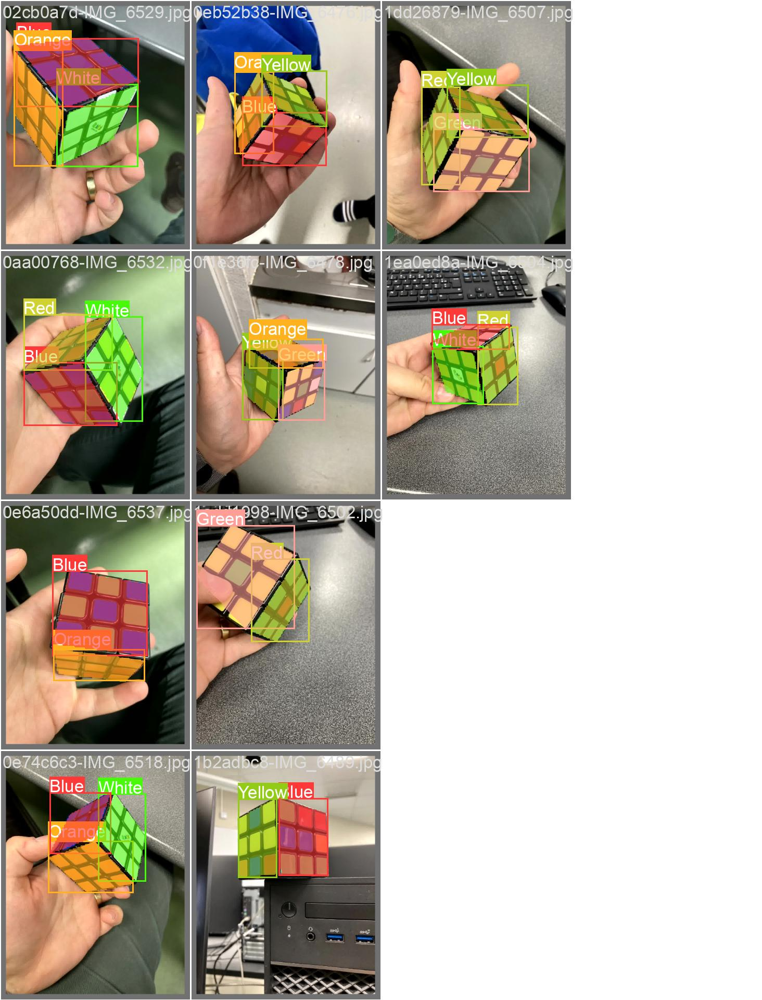
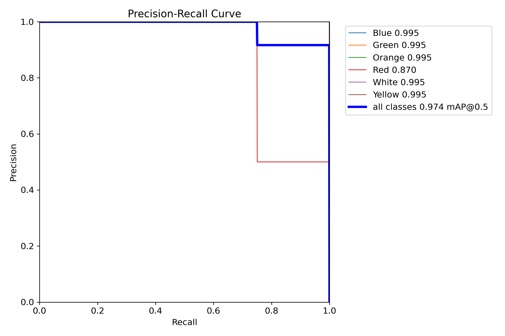
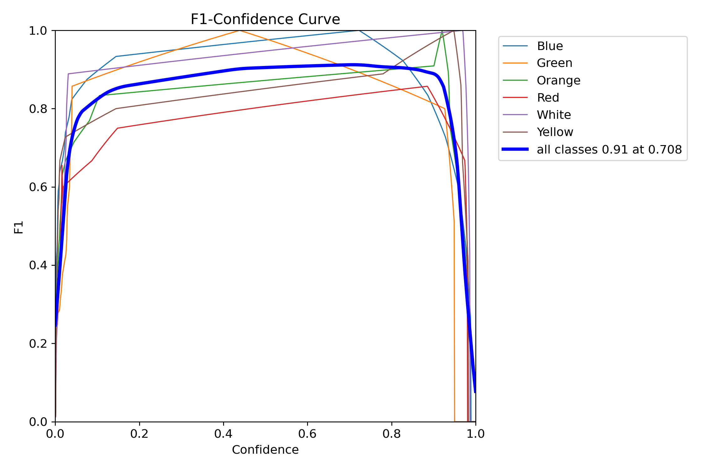

# Rubik's Cube Solver

## Description

This project is a Rubik's Cube Solver implemented in Swift. It uses OpenCV for image processing written in C++.
The C++ backend is packaged and stitched into the swift implementation. The code for the backend is available here: https://github.com/bukits/AR_VR_CORE

In this project the final approach is purely classical image processing based for the detection.

However we have created datasets for the Rubik's Cube to train a yolo segmentation model. The dataset will soon be available in a separate repository.

## Installation

1. Clone the repository.
2. Open `SwiftStitch.xcodeproj` in Xcode.
3. Install the necessary dependencies using the Podfile.

## Usage

1. Run the project in Xcode.
2. Follow the on-screen instructions to solve your Rubik's Cube.

## Contributing

Contributions are welcome. Please open an issue or submit a pull request.

## Contact

If you have any questions, please open an issue or contact the project owner.
bodis.balazs.1999 at gmail

## Taste from the dataset and YOLOv5 Segmentation performance on our small dataset.
 
 
 
 
